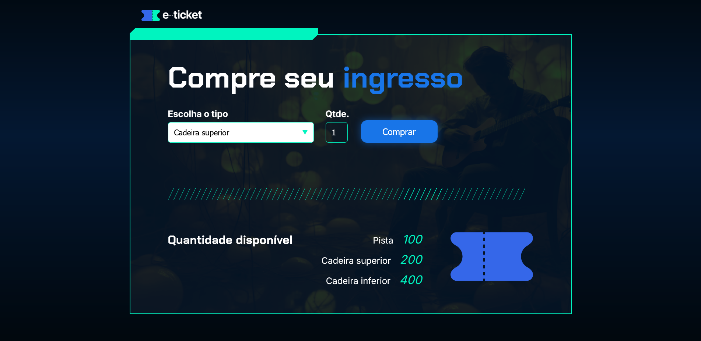

# Praticando-Logica
Aula prática de lógica de programação com a criação de 5 projetos.  
A pratica é em JavaScript, HTML e CSS.  

## Projeto Sorteador de Números

Este projeto contém uma função JavaScript para sortear números sem repetições. Confira a implementação no diretório abaixo:

- [sorteador-numeros](./sorteador-numeros/)

### Como usar
1. Acesse a pasta `sorteador-numeros`.
2. Execute o arquivo `index.html` para ver o sorteio em ação.
 

 
 

## Projeto AluGames

Este projeto contém lógica em JavaScript. Confira a implementação no diretório abaixo:

- [alugames](./alugames/)

### Como usar
1. Acesse a pasta `alugames`.
2. Execute o arquivo `index.html` para ver o exercício.
 

 
 

## Projeto Carrinho de compras

Este projeto contém lógica em JavaScript. Confira a implementação no diretório abaixo:

- [carrinho-compras](./carrinho-compras/)

### Como usar
1. Acesse a pasta `carrinho-compras`.
2. Execute o arquivo `index.html` para ver o exercício.
 

 
 

## Projeto Ingresso

Este projeto contém lógica em JavaScript. Confira a implementação no diretório abaixo:

- [ingresso](./ingresso/)

### Como usar
1. Acesse a pasta `ingresso`.
2. Execute o arquivo `index.html` para ver o exercício.
 

 
 

## Projeto Amigo Secreto

Este projeto contém lógica em JavaScript. Confira a implementação no diretório abaixo:

- [amigo-secreto](./amigo-secreto/)

### Como usar
1. Acesse a pasta `amigo-secreto`.
2. Execute o arquivo `index.html` para ver o exercício.
 

 
 